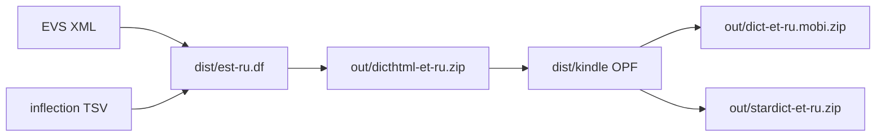

# How the dictionary is built

The installable files in `out/` are generated from the official EKI Estonian–Russian Dictionary (EVS) plus an inflection table, then converted to Kobo, Kindle, and StarDict formats.

## Sources

- **EVS XML** — [evs_EKI_CCBY40.xml](https://arhiiv.eki.ee/litsents/idkaart/evs/evs_EKI_CCBY40.xml) (~85 MB). [`scripts/build.sh`](../scripts/build.sh) downloads it to `cache/evs_EKI_CCBY40.xml` on first run. Not stored in git.
- **Inflections** — [`data/est_inflected_forms.tsv`](../data/est_inflected_forms.tsv). Lemma → comma-separated forms from [Ekilex](https://ekilex.ee), currently the [Estonian-Wordlist-Enriched-Ekilex](https://github.com/KristjanPikhof/Estonian-Wordlist-Enriched-Ekilex) snapshot. Refresh with `fetch-inflections` into `dist/` (does not overwrite this file).

## Pipeline



1. `build-est-ru-df` (from [`src/est_ru_df.rs`](../src/est_ru_df.rs)) parses EVS, attaches inflections, and writes a dictutil `.df` to `dist/est-ru.df`.
2. [`scripts/build.sh`](../scripts/build.sh) runs [dictgen](https://github.com/pgaskin/dictutil) (v0.3.2) to produce `out/dicthtml-et-ru.zip`.
3. `build-kindle` (from [`src/kindle.rs`](../src/kindle.rs)) turns that zip into Kindle OPF/XHTML under `dist/kindle/`.
4. [`scripts/build_kindle.sh`](../scripts/build_kindle.sh) runs [kindling-cli](https://github.com/ciscoriordan/kindling) (v0.38.0) to build `dict-et-ru.mobi`, then zips it to `out/dict-et-ru.mobi.zip`.
5. [`scripts/build_stardict.sh`](../scripts/build_stardict.sh) uses the same OPF, gzip-compresses `.dict` to `.dict.dz`, and zips the folder to `out/stardict-et-ru.zip`.

Kindle and StarDict both start from the Kobo zip. StarDict reuses `dist/kindle/dict.opf` if it is already there.

## Lookup keys

Each article in the `.df` has:

- `@` — searchable headword. Taken from the printed EVS `<x:m>` text, not the sort key `x:O`. Homographs such as `aga1` merge as `@ aga`.
- `&` — inflection variants from the TSV (and a compact unhyphenated spelling when the printed form has hyphens). Lemmas shorter than 3 letters get no inflections, so `a` does not steal `aga`.
- Extra `@` **aliases** for forms people type into a dictionary search box. In-book tap already follows `&` variants; typed search often only matches `@` headwords.

A variant becomes an alias when it is at least 3 letters and either:

- belongs to more than one lemma, or
- belongs to a verb (`v` / `vrm`).

That covers `olnud`, `olla`, `oli`, `sai`, `kirjutatud`, and similar forms. A verb form still gets an alias when the same spelling is already another lemma (`sai` the noun vs `saama`). Ordinary noun cases (`raamatut`) stay as `&` only — there are about two million of those. Two-letter forms (`on`) are not promoted.

Alias articles copy the parent definition and start with the lemma in italics (`olema`, `olnu`, …).

Other conversion details: Russian glosses are preferred; if none exist, Estonian `<x:d>` or a one-hop `<x:tvt>` see-also is used. Visible paradigms come from `<x:mv>`. Examples and phrases are trimmed.

## Directories

| Path | Role |
|------|------|
| `cache/` | EVS XML and downloaded binaries (gitignored) |
| `dist/` | Intermediate `.df` and Kindle OPF/XHTML (gitignored) |
| `out/` | Installable zips. Uncompressed `dict-et-ru.mobi` and `stardict-et-ru/` working copies are gitignored |

## Tools

- Rust (stable) — `cargo` builds `build-est-ru-df` and `build-kindle`
- `curl`
- [dictgen](https://github.com/pgaskin/dictutil) — installed with Go (`github.com/pgaskin/dictutil/cmd/dictgen@v0.3.2`) or a release binary. Apple Silicon needs Go; there is no official arm64 binary.
- [kindling-cli](https://github.com/ciscoriordan/kindling) v0.38.0 — downloaded by the Kindle/StarDict scripts.

## Rebuild

Kobo:

```bash
./scripts/build.sh
```

Kindle and StarDict (both need the Kobo zip):

```bash
./scripts/build_kindle.sh
./scripts/build_stardict.sh
```

## Refresh inflections

`fetch-inflections` queries the Ekilex API: search for a lemma, then read `paradigms[].forms[].value` from word details. Get a key at [ekilex.ee/userprofile](https://ekilex.ee/userprofile). By default it uses lemmas already in [`data/est_inflected_forms.tsv`](../data/est_inflected_forms.tsv) and writes a resumable checkpoint to `cache/ekilex_checkpoint.jsonl`. The new table goes to `dist/est_inflected_forms.ekilex.tsv` so you can compare before replacing the snapshot.

```bash
export EKILEX_API_KEY=your_key
cargo run --release --bin fetch-inflections
# later, after a stop or failure:
cargo run --release --bin fetch-inflections
# rebuild the TSV from an existing checkpoint only:
cargo run --release --bin fetch-inflections -- --export-only
```

`--words file.txt` uses a custom lemma list (one word per line). `--limit N` fetches only the first N pending lemmas. A full TSV pass is two HTTP calls per lemma plus a 0.1s pause. Re-runs skip checkpointed words. `--delay 0.05` goes faster; 429s back off on their own.

Run tests with `cargo test`.
